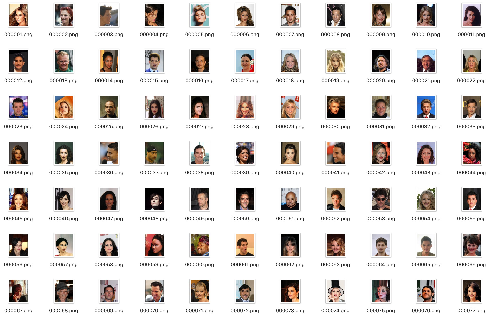
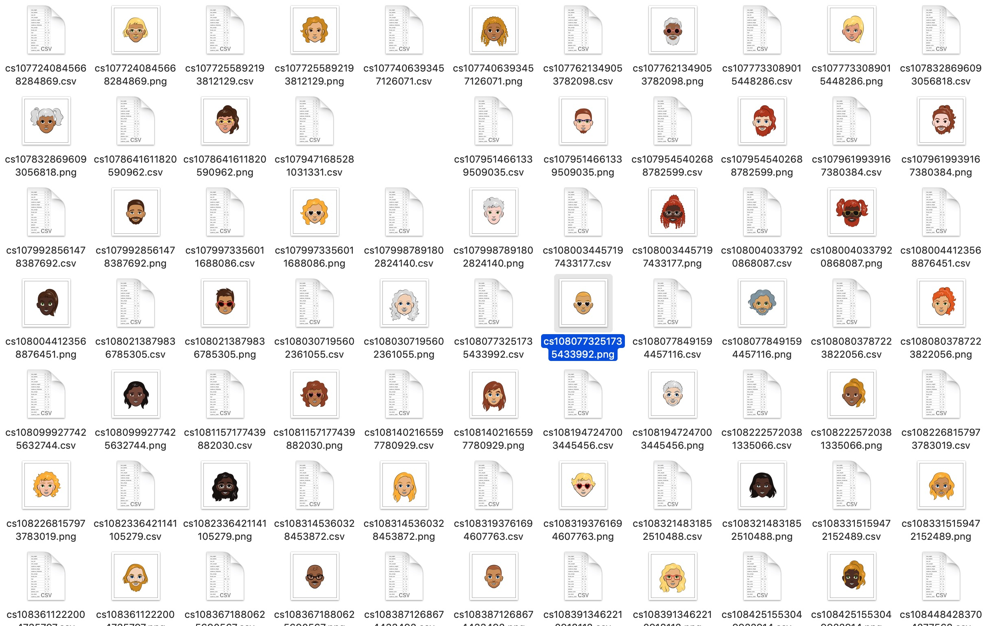
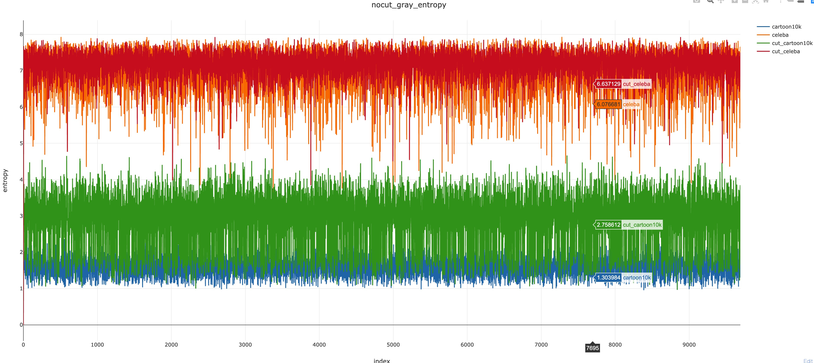

# ImageEntropy

## 目前找到的计算图像熵的方式：

### 一维熵：
基于灰度的实现

### 二维熵：

网上很少有开源，自己实现
1. 直接使用numpy进行计算 [GitHub](https://github.com/sivanWu0222/ImageEntropy/blob/master/utils/entropy.py)
2. 使用PyTorch的卷积核进行计算 [GitHub](https://github.com/sivanWu0222/ImageEntropy/blob/master/utils/entropy.py)

## 实验

### 数据
#### 真人数据
- Celeba数据集：img_align_celeba_png.7z(202599张真人图)

效果：

#### 卡通数据
- Google的Cartoon数据集：Cartoon10K(10k张动漫卡通图)

效果：

### 一位灰度熵的对比
Google的Cartoon数据集与Celeba数据集(选择10000张)的熵的对比：

## 参考
- [链接1](https://blog.csdn.net/a6333230/article/details/81021922)
- [链接2](https://blog.csdn.net/marleylee/article/details/78813630)
